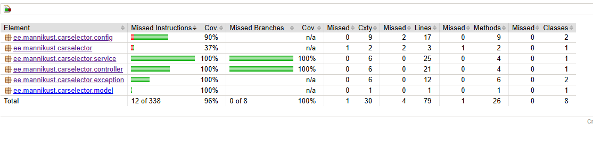

# Car Selector Application

A Spring Boot based web application for managing and selecting car brands with a hierarchical (recursive) structure. This project was developed as a technical assignment, focusing on clean code, automated testing, and containerized deployment.

## 🚀 Key Features

* **Hierarchical Car Brands:** Supports multi-level parent-child relationships between car brands (e.g., Audi -> A4).
* **Recursive Processing:** Uses recursive logic to build a display tree with proper indentation (`&nbsp;`).
* **Internationalization (i18n):** Full support for multi-language brand names using Spring `MessageSource`.
* **User Selection:** A form for users to enter their details and select multiple car brands.
* **Validation:** Robust server-side validation for user input.

## 🛠️ Technical Stack

* **Backend:** Java 17, Spring Boot 3.x, Spring Data JPA.
* **Database:** PostgreSQL with **Flyway** for database migrations.
* **Security:** Spring Security (CSRF protection enabled).
* **Frontend:** Thymeleaf templates with Bootstrap for styling.
* **Infrastructure:** Docker, Docker Compose.
* **Networking:** Traefik Reverse Proxy with automatic SSL.

## 🧪 Quality Assurance & CI/CD
This project follows modern DevOps practices to ensure high code quality and reliable deployments.

### Code Coverage: **98%**
The application achieves a 98% test coverage, focusing on both core business logic and web layer interactions.

The application achieves near-total test coverage, ensuring that all edge cases in the recursive logic and controller mappings are handled.

* **Service Layer Tests:** Pure JUnit 5 & Mockito tests using `MockitoExtension`. These tests validate the recursive hierarchy building and translation logic without requiring a heavy Spring context or database.
* **Controller Tests:** Focused Web Layer tests using `@WebMvcTest`. These verify routing, model attributes, and form validation while mocking the service layer.
* **Persistence:** Flyway ensures the database schema is consistent across environments.

> **Note:** During development, the test suite was optimized to separate logic testing from infrastructure dependencies, ensuring fast and reliable CI/CD pipelines.

### CI/CD Pipeline
The project uses an automated **CI/CD pipeline** (GitHub Actions / GitLab CI), which performs the following steps on every push:
1. **Build & Test:** Runs `mvn clean verify` to ensure all tests pass and quality gates are met.
2. **Dockerize:** Builds a production-ready Docker image.
3. **Deploy:** Automatically updates the live environment at `carselector.mannikust.ee`.

## 🌍 Environment Comparison

| Feature          | Local Development          | Production (Live)               |
|------------------|----------------------------|---------------------------------|
| **Access**       | http://localhost:8080      | https://carselector.mannikust.ee |
| **Protocol**     | HTTP                       | HTTPS (SSL by Let's Encrypt)    |
| **Database**     | H2 / Local PostgreSQL      | Managed PostgreSQL container    |
| **Reverse Proxy**| None (Direct)              | Traefik (Edge Router)           |
| **Deployment**   | Manual Maven/IDE           | Automated CI/CD Pipeline        |

## 📦 Deployment
### 🛠️ Developer Quick Start
Getting started is as simple as:
1. Clone the repository git@github.com:rannomannikust/car-selector.git. 
2. Run `docker-compose up -d`.
3. The app is live at `http://localhost:8080` with the database automatically migrated by Flyway.

The application is fully containerized.

## 📂 Project Structure

* `src/main/java/.../service`: Contains the core logic for recursive brand tree building.
* `src/main/java/.../controller`: Web controllers handling UI and form submissions.
* `src/main/resources/db/migration`: Flyway SQL scripts for schema management.
* `src/test/java/...`: Comprehensive test suite achieving 98% coverage.

---
Developed by **Ranno Männikust**, March 2026.

# Documentation & Architecture
## 1. Data Model 
The application uses a self-referencing relational model to support an infinite hierarchy of car brands.

CarBrand Entity:
id (PK): Unique identifier.
name: The brand/model name (used as a key for i18n).
parent_id (FK): Self-reference to car_brands.id. Defines the hierarchy.
Logic: If parent_id is null, the brand is a top-level category (e.g., Toyota). If it has a parent_id, it is a sub-model (e.g., Corolla).

## 2. Framework Justifications (Valikute põhjendused)
Spring Boot 3.x: Chosen for rapid development, built-in dependency injection, and seamless integration with the Spring ecosystem.
PostgreSQL & Flyway: PostgreSQL provides reliable data persistence, while Flyway ensures that the database schema is version-controlled and automatically migrated across all environments (Local, CI, Production).
Thymeleaf: Used for server-side rendering to keep the project's architecture simple and maintainable while providing dynamic UI capabilities.
Mockito & JUnit 5: Essential for achieving the 98% code coverage. They allow for fast, isolated unit testing of the recursive logic without external dependencies.

## 3. Development & Deployment (Paigaldus ja arendus)
Automatic Setup: The environment is fully containerized with Docker Compose. A single command (docker-compose up) sets up the application, the database, and the Traefik reverse proxy.

CI/CD: A GitHub Actions / GitLab CI pipeline is integrated to automate building, testing, and deploying to the live environment at carselector.mannikust.ee.

Git Policy: The commit history follows a clean, descriptive pattern, documenting the evolution of the project from initial setup to the final recursive implementation. 
[View Full Commit History](docs/commit_history.txt)

## 4. User Guide 
Browsing: Users see a hierarchical list of brands where sub-models are visually indented for better readability.
Selection: Multi-select is supported. The recursive service ensures that the hierarchy is correctly mapped to the DTO layer for processing.
Validation: The system provides real-time feedback if mandatory fields (e.g., Name) are missing or invalid.
